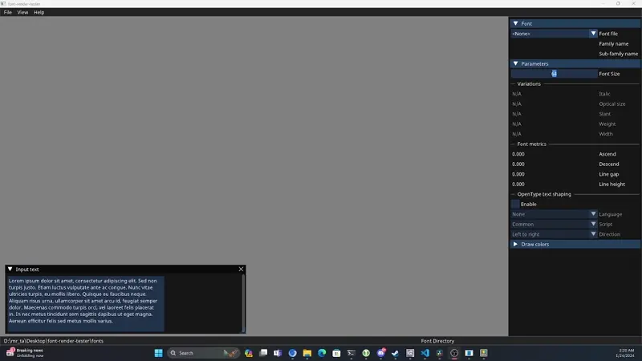
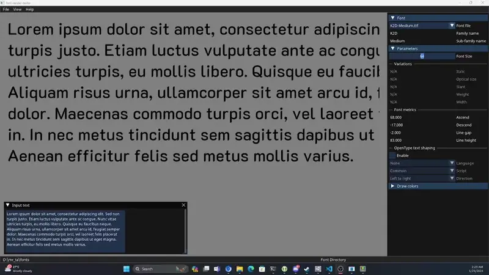
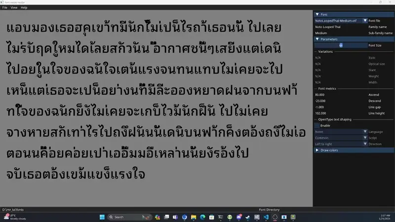
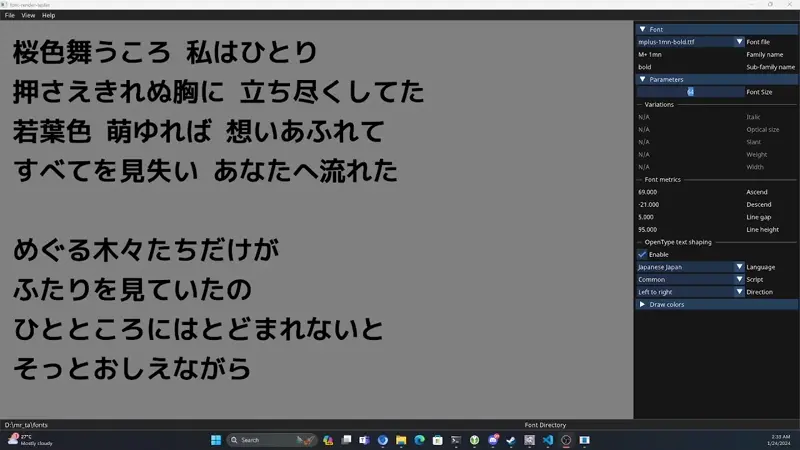
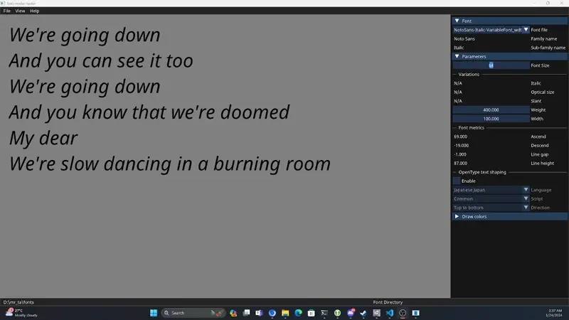

# Font-Render-Tester

__Font-Render-Tester__ is a tool that shows previews of text in a given font and different settings. It
supports font features like __font size__ and font variations (font width, weight, etc.). You can also
turns on and off OpenType shaping to see how the give text would render with specific OpenType settings
like __direction__, __script__ and __language__.

__Font-Render-Tester__ also shows some of the basic font metrics information like __Ascend__ or __Decend__.

Also, you can change fonts imediately from the list make it's quite useful to preview differnt font files.

__Font-Render-Tester__ is written in modern C++ and uses FreeType2 for glyph rendering and Harfbuzz for
OpenType shaping.

## Motivations

On my personal website, I'm maintaining a small list of games that support Thai and how they perform in
that regards. I need to create screenshot to shows how Thai text should looks like comparing to the actual
text in game. At first I was using Microsoft Word for that task. Later on I wants to learn more on how to
properly implement the text rendering so I created my own tool.

Also in my game engine, I need to specify the settings of the font metrics I'm using instead of reading
the value from the font file. Since the tool can shows some basic font metrics value, I can use this to
choose the font I'm going to use along with its metrics values.

## Usage

At the first run, the application works on its own font directory (the one used on the GUI). You can
change the font directory by choose menu `File->Change font directory`.

Once the font directory is set you can start playing with the toolbar on the right hand side.

You can play with OpenType text shaping, either enable or disable. For my use I usually uses it to find if
font can render Thai correctly when either text shaping is off or on, and when it's on does it need the
specific algorithm for the language or not.

You can also change the text direction in certains lanuage, like vertical text in Japanese.

__Notes__: screenshot contains lyrics from the song [_Sakura Iro Mau Koro_ by _Mika Nakashima_](https://www.youtube.com/watch?v=DZ_Ww5oCLPI) ℗2005 Sony Music Labels Inc.

For variable fonts, you can change any of the 5 common axis, depends on whether or not the axis is
supported by the given font.

__Notes__: screenshot contains lyrics from the song
[_Slow Dancing in a Burning Room_ by _John Mayer_(https://www.youtube.com/watch?v=DZ_Ww5oCLPI)
℗2006 Aware Records LLC.

